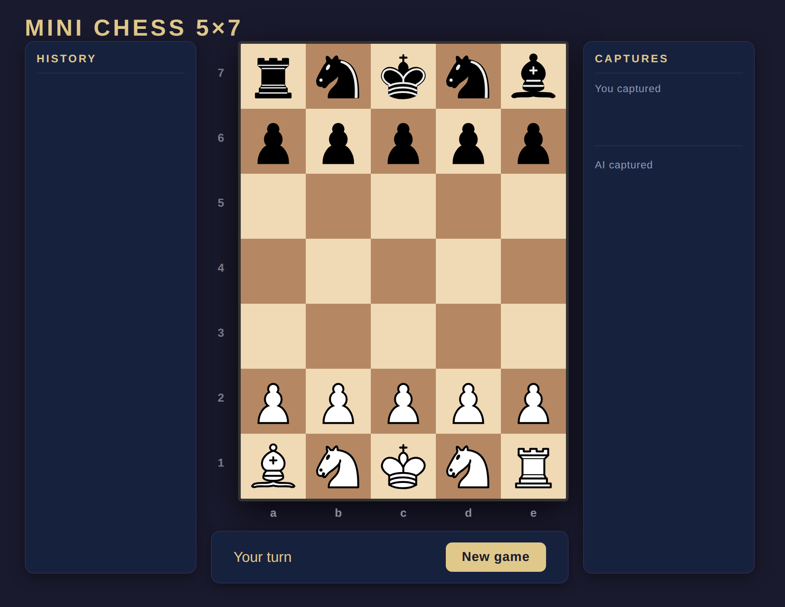

# ♟️ Mini Chess 5x7

Mini Chess 5x7 is a compact browser-based chess variant powered by a small Node.js game engine. Perfect for quick tactical training or learning the basics without the complexity of a full board.

---

## Quick Start

### Step 1

Clone the repository and install dependencies:

```bash
git clone https://github.com/expertos-tech/mini-chess-5x7.git
cd mini-chess-5x7
npm install
```

### Step 2

Run:

```bash
npm start
```

Open [http://localhost:3000/](http://localhost:3000/)

---

## Documentation

- [Architecture](docs/architecture.md)
- [Engineering decisions](docs/engineering-decisions.md)
- [Rules](docs/rules.md)
- [Testing](docs/testing.md)

---

## Installation

Before playing, ensure you have Node.js (version 24 or higher) installed.

---

## The 5x7 Variant Rules

This version is designed for speed while keeping the core "soul" of chess.

| Feature   | Description                                       |
| :-------- | :------------------------------------------------ |
| Board     | 5 columns (a-e) x 7 rows (1-7).                   |
| Setup     | [B][N][K][N][R] vs [r][n][k][n][b].               |
| Pawns     | Move 1 square at a time (no double-push).         |
| Promotion | Pawns promote to Rook upon reaching the 7th rank. |
| Castling  | Removed for the smaller board.                    |
| Special   | No Queens. No En Passant.                         |

### Initial Position

```txt
7   r  n  k  n  b
6   p  p  p  p  p
5   .  .  .  .  .
4   .  .  .  .  .
3   .  .  .  .  .
2   P  P  P  P  P
1   B  N  K  N  R
    a  b  c  d  e
```

---

## Gameplay Details

### Browser Mode

A modern, point-and-click interface.

- Interface: Real-time legal move highlighting.
- UI: Includes move history and captured piece tracking.
- Tech: Powered by Vue 3 and WebSockets.



---

## Project Details

### Architecture

- Engine (src/): Pure Node.js logic for move generation, AI, and state management.
- Frontend (public/): Vue 3 (CDN-based) with WebSockets for the UI.
- AI: Minimax algorithm with Alpha-Beta pruning (Depth 3).

### Scripts

```bash
npm start
npm test
npm run lint
npm run format:check
npm run check
```

---

## License and Freedom

This project is licensed under the MIT License.

You are free to:

- Copy and use this code for anything.
- Modify it, break it, and fix it.
- Sell it or give it away.
- Use it as a template for your own games.

---

## Join the Project!

This is an open project, and your help is more than welcome! Whether you are a beginner or a grandmaster of code, there is a place for you:

1. Fork it: Create your own copy and experiment!
2. Improve the AI: Can you make the engine smarter?
3. Refine the UI: Add animations, sounds, or new themes.
4. Fix Bugs: Found a weird move? Open an Issue or a PR.
5. Submit a PR: Made something cool? Send a Pull Request and let's merge it!

Happy coding and checkmate!
